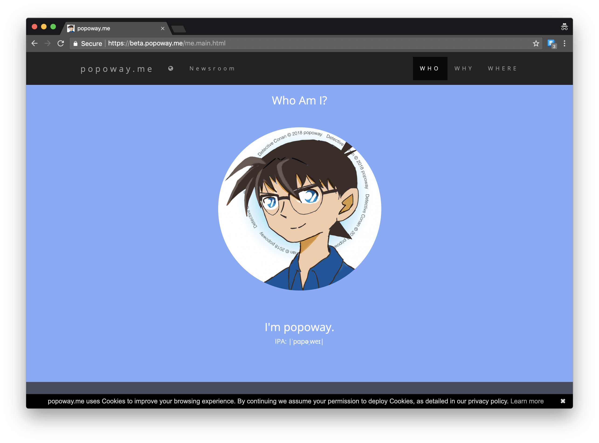

# popoway-me

  
A fast, responsive, colorful webpage, which actually is popoway's personal introduction.  

## Quick Links

Try it:
* release: [popoway.me](https://popoway.me)
* pre-release: [beta.popoway.me](https://beta.popoway.me/me.main.html)

Release Notes: [Release Notes](https://github.com/popoway/popoway-me/releases)  
TODO: [TODO](https://github.com/popoway/popoway-me/wiki/TODO)

## Status

Basic features should work, since it is rather stable.  
Project roadmap with planned features and approximate schedule is on [TODO](https://github.com/popoway/popoway-me/wiki/TODO) page.

## Browsers support

|  IE / Edge |  Firefox |  Chrome |  Safari |  iOS Safari |  Opera |
| --------- | --------- | --------- | --------- | --------- | --------- |
| Edge| last version| last version| last version| last 2 versions| last version

Full list is available [here](https://github.com/popoway/popoway-me/wiki/Supported-Platforms).

## Contributing

Give me [inspiration](mailto:popoway@popoway.cloud), or help [translate it](http://popoway-me.oneskyapp.com/collaboration/project/134083).  
You can also help the project or say "thank you" with this button:  
  

## License

popoway.me: [MIT](https://popoway.mit-license.org/)

popoway.me is made possible by the [popoway.me](https://github.com/popoway/popoway-me) open source project and [other open source software](https://github.com/popoway/popoway-me/wiki/Credits).
